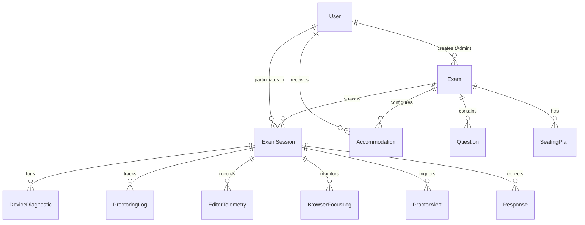

# Proctora Backend Implementation - Part 1

## Table of Contents
1. [Overview & Project Context](#overview--project-context)
2. [Dependencies & Technology Stack](#dependencies--technology-stack)
3. [Database Architecture & Data Models](#database-architecture--data-models)
4. [Backend Directory Structure](#backend-directory-structure)
5. [Detailed File-by-File & Function-by-Function Breakdown](#detailed-file-by-file--function-by-function-breakdown)
   - [Core Infrastructure & Middleware](#core-infrastructure--middleware)
   - [Module 1: Authentication & Registration Module (F.1)](#module-1-authentication--registration-module-f1)
   - [Module 2: Exam Configuration Module (F.3, F.11)](#module-2-exam-configuration-module-f3-f11)
   - [Module 3: Exam Delivery Module (F.2, F.3, F.10)](#module-3-exam-delivery-module-f2-f3-f10)
   - [Module 4: Integrity Monitoring Module (F.4, F.5, F.6, F.8, F.12)](#module-4-integrity-monitoring-module-f4-f5-f6-f8-f12)
   - [Module 5: Export & Evaluation Module (F.7, F.9)](#module-5-export--evaluation-module-f7-f9)
6. [Database Seed Data](#database-seed-data)
7. [API Endpoint & WebSocket Reference](#api-endpoint--websocket-reference)
8. [Functional Requirements Traceability Matrix](#functional-requirements-traceability-matrix)

---

## Overview & Project Context

**Proctora** is a Real-Time Online Examination System with Automated Proctoring and Suspicious Event Detection, built to support secure online assessments and competitive programming contests. 

This document details **Part 1 of the Backend Implementation**, constructed directly from the requirements in **`srs-1-1.pdf`**, the data flows in **`SRS_DFD_SC_AdarshBellamane_241IT004_updated-1.pdf`**, and the core module decomposition diagrams.

### Architectural Highlights
- **Decoupled Architecture**: Standardized RESTful APIs and real-time WebSockets separate backend services from web user interfaces.
- **Central Authority**: All validation, seat mapping, 2FA, proctoring score calculation, and telemetry recording logic are encapsulated in the backend to ensure security.
- **Real-Time Data Streaming**: Full-duplex WebSockets enable live telemetry streaming and proctoring alert broadcasts to the Administrator Dashboard.

---

## Dependencies & Technology Stack

The backend is built with Node.js and Express, leveraging Prisma ORM with SQLite for persistent local storage.

### Key Dependencies (`backend/package.json`)

| Dependency | Version | Purpose / Role in System |
| :--- | :--- | :--- |
| `express` | `^5.2.1` | Core HTTP application server routing & middleware framework. |
| `@prisma/client` | `^5.22.0` | Type-safe ORM query builder used for interacting with the database. |
| `prisma` | `^5.22.0` | Prisma CLI tool for schema management, migrations, and database seeding. |
| `ws` | `^8.21.3` | WebSocket library for real-time live alert broadcasts and telemetry streaming. |
| `jsonwebtoken` | `^9.0.3` | JSON Web Token (JWT) signing and verification for session management. |
| `bcryptjs` | `^3.0.3` | Hashing candidate and administrator passwords securely using bcrypt. |
| `otplib` | `^13.5.0` | Two-Factor Authentication (2FA) TOTP secret generation and code verification. |
| `cookie-parser` | `^1.4.7` | Express middleware for parsing cookies containing authentication session tokens. |
| `cors` | `^2.8.6` | Cross-Origin Resource Sharing handling for decoupled frontend communications. |
| `dotenv` | `^16.4.5` | Environment variable loader from `.env` files. |
| `zod` | `^4.4.3` | Schema validation utility. |
| `nodemon` | `^3.1.9` | Development utility that automatically restarts the Node server upon code edits. |

---

## Database Architecture & Data Models

Defined in `backend/prisma/schema.prisma`, the database schema matches the Level-1 & Level-2 Data Flow Diagrams:



### Models Summary

1. **`User`**: Stores candidate and admin credentials, name, email, roll number, hashed password, role (`STUDENT`/`ADMIN`), and 2FA secrets.
2. **`Exam`**: Stores exam metadata, duration, start/end timestamps, creator, and shuffling mode (`RANDOM` vs `SEATING`).
3. **`Question`**: Master question bank items supporting `MCQ`, `CODING`, and `SHORT_ANSWER` formats with starter code, test cases, and points.
4. **`SeatingPlan`**: Maps candidate roll numbers to specific seat row/col coordinates and seat labels (`Lab-A-R1-C1`).
5. **`Accommodation`**: Configures approved extended time (extra minutes) for specific candidates.
6. **`ExamSession`**: Tracks candidate exam status (`NOT_STARTED`, `DIAGNOSTICS_PASSED`, `IN_PROGRESS`, `COMPLETED`, `AUTOLOGOUT`, `TERMINATED`), assigned question order, timestamps, seat label, and violation counters.
7. **`DeviceDiagnostic`**: Stores pre-exam hardware diagnostic check results (webcam, microphone, bandwidth, browser compatibility).
8. **`ProctoringLog`**: Stores time-series video feed analysis records, calculated cheating probability scores, and flagged anomaly events.
9. **`EditorTelemetry`**: Captures timestamped code editor actions (keystrokes, text deltas, paste events, code run/submit) for playback.
10. **`BrowserFocusLog`**: Logs tab switching, window blur/focus events, and fullscreen exit attempts.
11. **`ProctorAlert`**: Stores real-time proctoring alerts triggered when cheating scores or focus loss thresholds are exceeded.
12. **`Response`**: Stores candidate answers (MCQ choices, code submissions) with autosave state flags and submission timestamps.

---

## Backend Directory Structure

```
backend/
├── package.json
├── prisma/
│   ├── dev.db
│   ├── schema.prisma
│   └── seed.js
└── src/
    ├── config/
    ├── index.js
    ├── lib/
    │   └── prisma.js
    ├── middleware/
    │   └── auth.middleware.js
    └── modules/
        ├── auth/
        │   ├── auth.controller.js
        │   ├── auth.routes.js
        │   └── auth.service.js
        ├── evaluation-export/
        │   ├── evaluation-export.controller.js
        │   ├── evaluation-export.routes.js
        │   └── evaluation-export.service.js
        ├── exam-config/
        │   ├── exam-config.controller.js
        │   ├── exam-config.routes.js
        │   └── exam-config.service.js
        ├── exam-delivery/
        │   ├── exam-delivery.controller.js
        │   ├── exam-delivery.routes.js
        │   └── exam-delivery.service.js
        └── integrity-monitoring/
            ├── integrity-monitoring.controller.js
            ├── integrity-monitoring.routes.js
            └── integrity-monitoring.service.js
```

---

## Detailed File-by-File & Function-by-Function Breakdown

### Core Infrastructure & Middleware

#### 1. `backend/src/index.js`
The entry point of the backend application.
- **Functions & Setup**:
  - `wss.on('connection')`: Initializes the WebSocket server at `/ws/proctor`. Manages client connections (`connectedClients`) and broadcasts real-time alert/telemetry messages to listening Admin Dashboards.
  - **Middleware Registration**: Express JSON parser (10MB payload limit for video/telemetry logs), cookie parser, and dynamic CORS configuration.
  - **Route Mounting**: Mounts all 5 core module routers onto `/api/auth`, `/api/config`, `/api/delivery`, `/api/monitoring`, and `/api/evaluation`.
  - `/api/health`: Health-check endpoint returning system mode, active modules list, and runtime memory diagnostics.
  - **Global Error Handler**: Middleware that catches uncaught errors and formats response error payloads based on development vs production mode.

#### 2. `backend/src/lib/prisma.js`
Exports a singleton instance of `PrismaClient` to maintain a single efficient database connection pool across the application modules.

#### 3. `backend/src/middleware/auth.middleware.js`
- **`authenticateToken(req, res, next)`**: Extracts JWT token from either the `Authorization` header (`Bearer <token>`) or HTTP-only cookies (`req.cookies.token`). Verifies token signature with `JWT_SECRET` and attaches user payload (`req.user`) to request. Returns `401 Unauthorized` or `403 Forbidden` if invalid.
- **`requireAdmin(req, res, next)`**: Guard middleware checking if `req.user.role === 'ADMIN'`. Returns `403 Access Denied` if candidate attempts admin operations.

---

### Module 1: Authentication & Registration Module (F.1)

#### `auth.service.js`
- **`registerCandidate(data)`**: Validates uniqueness of candidate email and roll number. Hashes password using `bcrypt.hash()`, generates 2FA secret using `otplib.generateSecret()`, persists candidate in DB with `STUDENT` role, and constructs standard `otpauth://` URI.
- **`registerAdmin(data)`**: Creates administrator account with `ADMIN` role and 2FA secret.
- **`validateCredentials(email, password)`**: Finds user by email and validates plain password against `passwordHash` using `bcrypt.compare()`.
- **`verify2FAAndLogin(userId, token)`**: Verifies 2FA TOTP token against user's secret using `otplib.verify()` (or accepts test token `'123456'`). Enables 2FA for user if first login and signs 8-hour JWT token containing user metadata.

#### `auth.controller.js`
- **`register(req, res)`**: Endpoint handler for POST `/api/auth/register`. Dispatches candidate vs admin registration.
- **`login(req, res)`**: Endpoint handler for POST `/api/auth/login`. Validates credentials and returns userId requiring 2FA.
- **`verify2FA(req, res)`**: Endpoint handler for POST `/api/auth/verify-2fa`. Validates TOTP code, sets HTTP-only session cookie, and returns JWT token.
- **`getProfile(req, res)`**: Endpoint handler for GET `/api/auth/me`. Returns authenticated user details.

#### `auth.routes.js`
Maps endpoints to controller functions (`/register`, `/login`, `/verify-2fa`, `/me`).

---

### Module 2: Exam Configuration Module (F.3, F.11)

#### `exam-config.service.js`
- **`createExam(adminId, data)`**: Persists new exam configuration (title, description, duration, start/end time, shuffling mode `RANDOM` or `SEATING`).
- **`getExamList()`**: Queries all exams along with aggregated counts for questions, seating plans, accommodations, and active sessions.
- **`getExamById(examId)`**: Retrieves full exam details including question bank, seating plans, and candidate accommodations.
- **`addQuestionsToExam(examId, questions)`**: Bulk inserts question items (MCQ choices, starter code, test cases, points) into an exam.
- **`uploadSeatingPlan(examId, seatingEntries)`**: Replaces seating plan for an exam, mapping roll numbers to seat row, seat column, and seat label (`Lab-A-R1-C1`).
- **`configureAccommodation(examId, candidateId, extraMinutes, notes)`**: Upserts candidate accommodation record granting extended exam duration.

#### `exam-config.controller.js`
Handlers for exam CRUD, question uploading, seating plan parsing, and accommodation setup.

#### `exam-config.routes.js`
Exposes `/api/config` endpoints with `requireAdmin` protections for setup routes.

---

### Module 3: Exam Delivery Module (F.2, F.3, F.10)

#### `exam-delivery.service.js`
- **`recordDiagnostics(candidateId, sessionId, diagnosticData)`**: Records browser version, webcam status, microphone status, and bandwidth status. Updates session status to `DIAGNOSTICS_PASSED` if all checks pass, or logs remediation guidance.
- **`shuffleQuestionsBySeating(questions, seatRow, seatCol, rollNumber)`**: Deterministic question shuffling algorithm using seat coordinates `(seatRow, seatCol)` and roll number PRNG seed to ensure adjacent seats receive different question orderings.
- **`startOrResumeSession(candidateId, examId)`**: Initializes or resumes candidate session. Checks candidate seating allocation and accommodation extra time, calculates combined total duration, shuffles questions, and saves question order JSON.
- **`launchExam(sessionId)`**: Updates session state to `IN_PROGRESS` and logs `startedAt` timestamp.

#### `exam-delivery.controller.js` & `exam-delivery.routes.js`
API handlers for session initialization (`/start-session`), hardware diagnostics submission (`/diagnostics`), and exam launch (`/launch`).

---

### Module 4: Integrity Monitoring Module (F.4, F.5, F.6, F.8, F.12)

#### `integrity-monitoring.service.js`
- **`logProctorFrame(candidateId, sessionId, frameData)`**: Processes continuous video telemetry (gaze direction, head pose angle, face count, low light). Applies rolling window analysis to compute cheating score (0.0 to 1.0) and flag anomalies while filtering transient false positives.
- **`logEditorTelemetry(candidateId, sessionId, questionId, eventType, eventData)`**: Records timestamped editor actions (`KEYSTROKE`, `TEXT_DELTA`, `PASTE`, `RUN`, `SUBMIT`) into a serialized timeline for admin playback.
- **`logBrowserFocusEvent(candidateId, sessionId, eventType)`**: Logs tab visibility loss (`BLUR`, `VISIBILITY_HIDDEN`) and fullscreen exit attempts (`FULLSCREEN_EXIT`). Increments session violation counters and triggers `FOCUS_LOSS_EXCEEDED` alert if infractions threshold (>=3) is reached.
- **`checkAndLogoutIdleSessions(maxIdleSeconds)`**: Automated background service that checks candidate `lastActivityAt`. Automatically terminates idle sessions (`AUTOLOGOUT`), frees the seat, and generates critical admin alerts.
- **`getSessionTelemetryPlayback(sessionId)`**: Fetches complete chronological timeline (proctoring logs, code editor telemetries, focus events, alerts) for contest replay.

#### `integrity-monitoring.controller.js` & `integrity-monitoring.routes.js`
Routes for live candidate telemetry streams and admin playback review (`/proctor-frame`, `/telemetry`, `/focus-event`, `/playback/:sessionId`, `/check-idle`).

---

### Module 5: Export & Evaluation Module (F.7, F.9)

#### `evaluation-export.service.js`
- **`autosaveResponse(candidateId, sessionId, questionId, answerText, codeSubmission)`**: Continuously upserts draft responses into database marked with `isAutoSaved: true` to prevent data loss.
- **`finalizeSubmission(candidateId, sessionId, finalResponses)`**: Persists final response set and marks exam session status as `COMPLETED`.
- **`generateCSVReport(examId)`**: Compiles exam results into a downloadable CSV string including candidate details, roll numbers, seat labels, status, focus loss count, fullscreen violations, max cheating score, and response counts.
- **`generatePDFReportData(examId)`**: Constructs structured JSON payload containing overall analytics, cheating statistics, and candidate responses suitable for PDF report rendering.

#### `evaluation-export.controller.js` & `evaluation-export.routes.js`
Routes for response autosaving (`/autosave`), manual/timer submission (`/submit`), CSV download (`/export/csv/:examId`), and PDF data (`/export/pdf/:examId`).

---

## Database Seed Data

The database is seeded via `backend/prisma/seed.js` with testing data:

- **Admin User**:
  - Email: `admin@proctora.edu`
  - Password: `admin123`
  - Role: `ADMIN`
- **Candidate User 1**:
  - Name: `Adarsh Bellamane`
  - Roll Number: `241IT004`
  - Email: `candidate@proctora.edu`
  - Password: `student123`
  - Accommodation: Approved +15 extra minutes
  - Seat Allocation: `Lab-A-R1-C1`
- **Candidate User 2**:
  - Name: `Harshith Vellapha`
  - Roll Number: `241IT033`
  - Email: `harshith@proctora.edu`
  - Password: `student123`
  - Seat Allocation: `Lab-A-R1-C2`
- **Sample Exam**: `IT303: Software Engineering & DSA Assessment` (45 min duration, 2 questions: 1 MCQ + 1 Coding).

---

## API Endpoint & WebSocket Reference

### HTTP API Endpoints

| Module | Method | Endpoint | Access | Description |
| :--- | :--- | :--- | :--- | :--- |
| **Auth** | POST | `/api/auth/register` | Public | Register Candidate or Admin account |
| **Auth** | POST | `/api/auth/login` | Public | Validate credentials & trigger 2FA |
| **Auth** | POST | `/api/auth/verify-2fa` | Public | Verify TOTP code and issue session token |
| **Auth** | GET | `/api/auth/me` | Authenticated | Retrieve current user profile |
| **Config** | GET | `/api/config` | Authenticated | List available exams |
| **Config** | GET | `/api/config/:examId` | Authenticated | Get detailed exam details & questions |
| **Config** | POST | `/api/config` | Admin Only | Create new exam |
| **Config** | POST | `/api/config/:examId/questions` | Admin Only | Upload question bank |
| **Config** | POST | `/api/config/:examId/seating` | Admin Only | Upload seating plan |
| **Config** | POST | `/api/config/:examId/accommodations` | Admin Only | Grant candidate extra time accommodation |
| **Delivery** | POST | `/api/delivery/start-session` | Candidate | Start/Resume session with question shuffling |
| **Delivery** | POST | `/api/delivery/diagnostics` | Candidate | Submit hardware compatibility check |
| **Delivery** | POST | `/api/delivery/launch` | Candidate | Launch live exam timer |
| **Monitoring** | POST | `/api/monitoring/proctor-frame` | Candidate | Post video telemetry frame & compute score |
| **Monitoring** | POST | `/api/monitoring/telemetry` | Candidate | Record editor keystrokes/deltas |
| **Monitoring** | POST | `/api/monitoring/focus-event` | Candidate | Log blur, tab switch, or fullscreen exit |
| **Monitoring** | GET | `/api/monitoring/playback/:sessionId` | Admin Only | Fetch full telemetry playback timeline |
| **Monitoring** | POST | `/api/monitoring/check-idle` | Admin Only | Trigger auto-logout check for idle sessions |
| **Evaluation**| POST | `/api/evaluation/autosave` | Candidate | Continuous draft response autosave |
| **Evaluation**| POST | `/api/evaluation/submit` | Candidate | Finalize exam submission |
| **Evaluation**| GET | `/api/evaluation/export/csv/:examId` | Admin Only | Download CSV results report |
| **Evaluation**| GET | `/api/evaluation/export/pdf/:examId` | Admin Only | Get PDF analytics report data |

### Real-Time WebSocket Endpoint

- **URL**: `ws://localhost:3000/ws/proctor`
- **Protocol**: Full-duplex JSON messaging.
- **Message Types**:
  - `CONNECTED`: Connection established acknowledgement.
  - `HIGH_CHEATING_SCORE`: Live proctoring alert push.
  - `FOCUS_LOSS_EXCEEDED`: Tab focus violation alert push.
  - `IDLE_TIMEOUT`: Auto-logout event notification.

---

## Functional Requirements Traceability Matrix

| Requirement | SRS Description | Backend Implementation Mapping |
| :--- | :--- | :--- |
| **F.1** | Authenticate and Register Users | `auth.service.js`, `auth.controller.js`, 2FA TOTP verification, bcrypt hashing, JWT session tokens. |
| **F.2** | Verify Device Compatibility | `exam-delivery.service.js` -> `recordDiagnostics()` logging webcam, mic, bandwidth, browser status. |
| **F.3** | Process Seating Plans & Question Shuffling | `exam-config.service.js` -> `uploadSeatingPlan()`, `exam-delivery.service.js` -> `shuffleQuestionsBySeating()`. |
| **F.4** | AI Proctoring & False Positive Reduction | `integrity-monitoring.service.js` -> `logProctorFrame()` rolling window score calculation. |
| **F.5** | Record Code Editor Telemetry | `integrity-monitoring.service.js` -> `logEditorTelemetry()` timestamped keystroke/delta timeline logger. |
| **F.6** | Monitor Browser Focus | `integrity-monitoring.service.js` -> `logBrowserFocusEvent()` tracking blur, tab visibility, and focus loss count. |
| **F.7** | Collect & Evaluate Responses | `evaluation-export.service.js` -> `autosaveResponse()` & `finalizeSubmission()`. |
| **F.8** | Send Real-Time Proctoring Alerts | `integrity-monitoring.service.js` alert generator + `index.js` WebSocket broadcast to Admin Dashboard. |
| **F.9** | Export Exam Results & Reports | `evaluation-export.service.js` -> `generateCSVReport()` & `generatePDFReportData()`. |
| **F.10** | Enforce Fullscreen Mode | `integrity-monitoring.service.js` -> `logBrowserFocusEvent('FULLSCREEN_EXIT')` tracking exit attempts. |
| **F.11** | Apply Candidate Accommodations | `exam-config.service.js` -> `configureAccommodation()`, `exam-delivery.service.js` timer adjustment. |
| **F.12** | Auto-Logout Idle Sessions | `integrity-monitoring.service.js` -> `checkAndLogoutIdleSessions()` auto-terminating inactive seats. |

---
*Document created for Proctora Backend Implementation - Part 1.*
